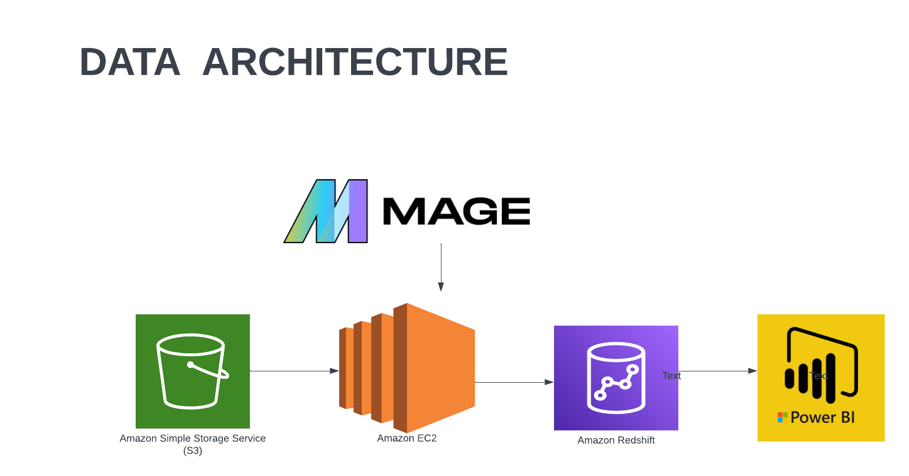

# taxi-data-analysis-project-using-AWS-tech-stacks-and-mage.ai

# Introduction

The goal of this project is to perform data analytics on Uber data using various tools and technologies, including AWS S3, Python, AWS EC2 Instance, Mage Data Pipeline Tool, AWS Redshift Data Warehouse, and Power BI for visualization.

# Technology Used

Programming Language - Python

AWS Cloud Service

1. AWS S3
2. AWS EC2 Instance
3. AWS Redshift
4. Power BI

Modern Data Pipeine Tool - https://www.mage.ai/

Contibute to this open source project - https://github.com/mage-ai/mage-ai

